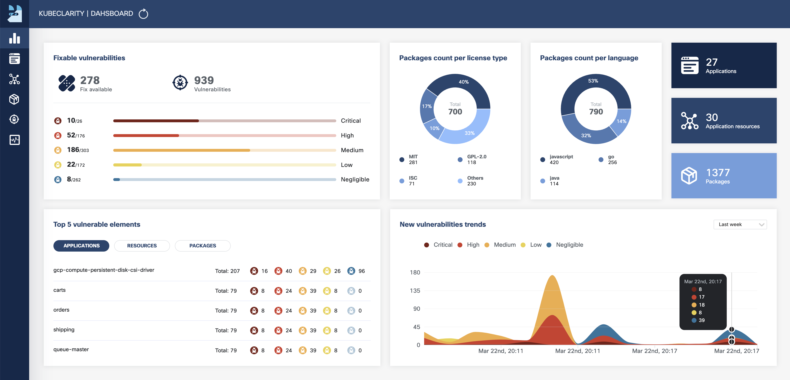
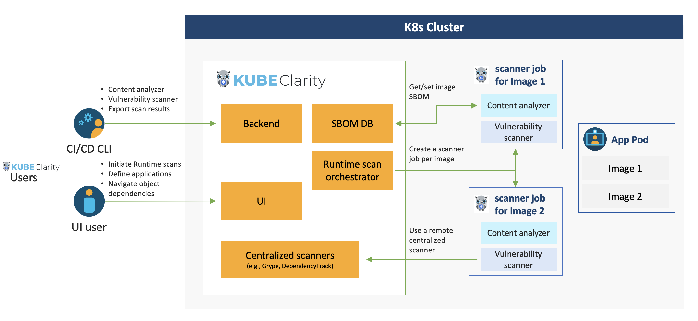

KubeClarity is a tool for detection and management of Software Bill Of Materials (SBOM) and vulnerabilities of container images and filesystems. It scans both runtime K8s clusters and CI/CD pipelines for enhanced software supply chain security.



## Why?
### SBOM & Vulnerability Detection Challenges

- Effective vulnerability scanning requires an accurate Software Bill Of Materials (SBOM) detection:
  - Various programming languages and package managers
  - Various OS distributions
  - Package dependency information is usually stripped upon build
- Which one is the best scanner/SBOM analyzer?
- What should we scan: Git repos, builds, container images or runtime?
- Each scanner/analyzer has its own format - how to compare the results?
- How to manage the discovered SBOM and vulnerabilities?
- How are my applications affected by a newly discovered vulnerability?

### Solution

- Separate vulnerability scanning into 2 phases:
  - Content analysis to generate SBOM
  - Scan the SBOM for vulnerabilities
- Create a pluggable infrastructure to:
  - Run several content analyzers in parallel
  - Run several vulnerability scanners in parallel
- Scan and merge results between different CI stages using KubeClarity CLI
- Runtime K8s scan to detect vulnerabilities discovered post-deployment
- Group scanned resources (images/directories) under defined applications to navigate the object tree dependencies (applications, resources, packages, vulnerabilities)

## Architecture



## Getting Started
### KubeClarity Backend
#### Install using Helm:

1. Add Helm repo

   ```shell
   helm repo add kubeclarity https://openclarity.github.io/kubeclarity
   ```
2. Save KubeClarity default chart values
    ```shell
    helm show values kubeclarity/kubeclarity > values.yaml
    ```

3. Check the configuration in `values.yaml` and update the required values if
   needed. To enable and configure the supported SBOM generators and
   vulnerability scanners, please check the "analyzer" and "scanner" config under
   the "vulnerability-scanner" section in Helm values.

4. Deploy KubeClarity with Helm

   ```shell
   helm install --values values.yaml --create-namespace kubeclarity kubeclarity/kubeclarity -n kubeclarity
   ```

   or for OpenShift Restricted SCC compatible install:

   ```shell
   helm install --values values.yaml --create-namespace kubeclarity kubeclarity/kubeclarity -n kubeclarity --set global.openShiftRestricted=true \
     --set kubeclarity-postgresql.securityContext.enabled=false --set kubeclarity-postgresql.containerSecurityContext.enabled=false \
     --set kubeclarity-postgresql.volumePermissions.enabled=true --set kubeclarity-postgresql.volumePermissions.securityContext.runAsUser="auto" \
     --set kubeclarity-postgresql.shmVolume.chmod.enabled=false
   ```

3. Port forward to KubeClarity UI:

   ```shell
   kubectl port-forward -n kubeclarity svc/kubeclarity-kubeclarity 9999:8080
   ```

4. Open KubeClarity UI in the browser: <http://localhost:9999/>

> **NOTE**  
> KubeClarity requires these K8s permissions:
> | Permission | Reason |
> | ---        | ---    |
> | Read secrets in CREDS_SECRET_NAMESPACE (default: kubeclarity) | This is allow you to configure image pull secrets for scanning private image repositories. |
> | Read config maps in the KubeClarity deployment namespace. | This is required for getting the configured template of the scanner job. |
> | List pods in cluster scope. | This is required for calculating the target pods that need to be scanned. |
> | List namespaces. | This is required for fetching the target namespaces to scan in K8s runtime scan UI. |
> | Create & delete jobs in cluster scope. | This is required for managing the jobs that will scan the target pods in their namespaces. |

#### Uninstall using Helm:

1. Helm uninstall

   ```shell
   helm uninstall kubeclarity -n kubeclarity
   ```

2. Clean resources

    By default, Helm will not remove the PVCs and PVs for the StatefulSets. Run the following command to delete them all:

    ```shell
    kubectl delete pvc -l app.kubernetes.io/instance=kubeclarity -n kubeclarity
    ```

#### Build and Run Locally with Demo Data

1. Build UI & backend and start the backend locally (2 options):
    1. Using docker:
        1. Build UI and backend (the image tag is set using VERSION):
           ```shell
           VERSION=test make docker-backend
           ```
        2. Run the backend using demo data:
           ```shell
           docker run -p 8080:8080 -e FAKE_RUNTIME_SCANNER=true -e FAKE_DATA=true -e ENABLE_DB_INFO_LOGS=true -e DATABASE_DRIVER=LOCAL ghcr.io/openclarity/kubeclarity:test run
           ```
    2. Local build:
        1. Build UI and backend
           ```shell
           make ui && make backend
           ```
        2. Copy the built site:
           ```shell
           cp -r ./ui/build ./site
           ```
        3. Run the backend locally using demo data:
           ```shell
           FAKE_RUNTIME_SCANNER=true DATABASE_DRIVER=LOCAL FAKE_DATA=true ENABLE_DB_INFO_LOGS=true ./backend/bin/backend run
           ```

2. Open KubeClarity UI in the browser: <http://localhost:8080/>

### CLI

KubeClarity includes a CLI that can be run locally and especially useful for CI/CD pipelines.
It allows to analyze images and directories to generate SBOM, and scan it for vulnerabilities.
The results can be exported to KubeClarity backend.

#### Installation

<details><summary>Binary Distribution</summary><p>

Download the release distribution for your OS from the
[releases page](https://github.com/openclarity/kubeclarity/releases)

Unpack the `kubeclarity-cli` binary, add it to your PATH, and you are good to go!

</p></details>

<details><summary>Docker Image</summary><p>

A Docker image is available at `ghcr.io/openclarity/kubeclarity-cli` with list of
available tags [here](https://github.com/openclarity/kubeclarity/pkgs/container/kubeclarity-cli/versions).

</p></details>

<details><summary>Local Compilation</summary><p>

```
make cli
```

Copy `./cli/bin/cli` to your PATH under `kubeclarity-cli`.

</p></details>

#### SBOM Generation

Usage:
```
kubeclarity-cli analyze <image/directory name> --input-type <dir|file|image(default)> -o <output file or stdout>
```

Example:
```
kubeclarity-cli analyze --input-type image nginx:latest -o nginx.sbom
```

Optionally a list of the content analyzers to use can be configured using the `ANALYZER_LIST` env
variable seperated by a space (e.g `ANALYZER_LIST="<analyzer 1 name> <analyzer 2 name>"`)

Example:
```
ANALYZER_LIST="syft gomod" kubeclarity-cli analyze --input-type image nginx:latest -o nginx.sbom
```

#### Vulnerability Scanning

Usage:
```
kubeclarity-cli scan <image/sbom/directoty/file name> --input-type <sbom|dir|file|image(default)> -f <output file>
```

Example:
```
kubeclarity-cli scan nginx.sbom --input-type sbom
```

Optionally a list of the vulnerability scanners to use can be configured using the `SCANNERS_LIST` env
variable seperated by a space (e.g `SCANNERS_LIST="<Scanner1 name> <Scanner2 name>"`)

Example:
```
SCANNERS_LIST="grype trivy" kubeclarity-cli scan nginx.sbom --input-type sbom
```

#### Exporting Results to KubeClarity Backend

To export CLI results to the KubeClarity backend, need to use an application ID as defined by the KubeClarity backend.
The application ID can be found in the Applications screen in the UI or using the KubeClarity API.

##### Exporting SBOM

```
## The SBOM can be exported to KubeClarity backend by setting the BACKEND_HOST env variable and the -e flag.
## Note: Until TLS is supported, BACKEND_DISABLE_TLS=true should be set.
BACKEND_HOST=<KubeClarity backend address> BACKEND_DISABLE_TLS=true kubeclarity-cli analyze <image> --application-id <application ID> -e -o <SBOM output file>

## For example:
BACKEND_HOST=localhost:9999 BACKEND_DISABLE_TLS=true kubeclarity-cli analyze nginx:latest --application-id 23452f9c-6e31-5845-bf53-6566b81a2906 -e -o nginx.sbom
```

##### Exporting Vulnerability Scan Results

```
## The vulnerability scan result can be exported to KubeClarity backend by setting the BACKEND_HOST env variable and the -e flag.
## Note: Until TLS is supported, BACKEND_DISABLE_TLS=true should be set.

BACKEND_HOST=<KubeClarity backend address> BACKEND_DISABLE_TLS=true kubeclarity-cli scan <image> --application-id <application ID> -e

## For example:
SCANNERS_LIST="grype" BACKEND_HOST=localhost:9999 BACKEND_DISABLE_TLS=true kubeclarity-cli scan nginx.sbom --input-type sbom  --application-id 23452f9c-6e31-5845-bf53-6566b81a2906 -e
```

## Limitations

1. Supports Docker Image Manifest V2, Schema 2 (https://docs.docker.com/registry/spec/manifest-v2-2/). It will fail to scan earlier versions.

## Roadmap
- Integration with additional content analyzers (SBOM generators)
- Integration with additional vulnerability scanners
- CIS Docker benchmark in UI
- Image signing using [Cosign](https://github.com/sigstore/cosign)
- CI/CD metadata signing and attestation using [Cosign](https://github.com/sigstore/cosign) and [in-toto](https://github.com/in-toto/in-toto) (supply chain security)
- System settings and user management
